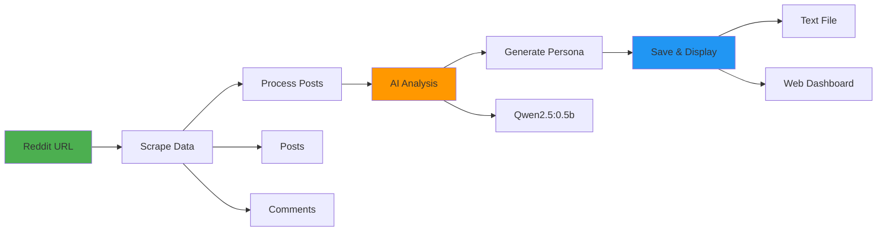

#  Reddit Persona Generator

A powerful AI-powered tool to analyze any public Reddit user and generate a structured psychological persona using open-source LLMs. Built with **Streamlit**, **Ollama**, and **Plotly**, this app scrapes user posts/comments and uses Qwen2.5 to summarize behavior, interests, and personality traits  all locally, without sending data to the cloud.

##  Features

-  Analyze public Reddit profiles via URL  
-  Local persona generation using `qwen2.5:0.5b` via **Ollama**
-  Interactive activity dashboards (subreddits, post types)
-  Exports detailed persona reports with confidence scores
-  Clean Streamlit UI with expandable insights
-  No external APIs or tokens needed

## Files

- `reddit_persona_backend.py` - Core scraping and analysis logic
- `streamlit_app.py` - Web interface
- `requirements.txt` - Python dependencies

## Setup

1. Install dependencies:
```bash
pip install streamlit requests beautifulsoup4 ollama pandas plotly
```

2. Install Ollama and the model:
```bash
curl -fsSL https://ollama.ai/install.sh | sh
ollama serve
ollama pull qwen2.5:0.5b
```

3. Run the app:
```bash
streamlit run streamlit_app.py
```

## Usage

### Web Interface
1. Open http://localhost:8501 in your browser
2. Enter a Reddit profile URL like `https://www.reddit.com/user/username/`
3. Click "Analyze Profile"
4. View the generated persona

### FLOW


## Output

Generates a text file with:
- User demographics
- Interests and hobbies
- Personality traits
- Online behavior patterns
- Supporting evidence from posts

Example output saved as `persona_username_timestamp.txt`

## Requirements

- Python 3.8+
- 4GB RAM for the AI model
- Internet connection for Reddit scraping

## Note

- Only works with public Reddit profiles
- All processing done locally (no external APIs)
- Analysis quality depends on how active the user is
- Respects Reddit's rate limits

